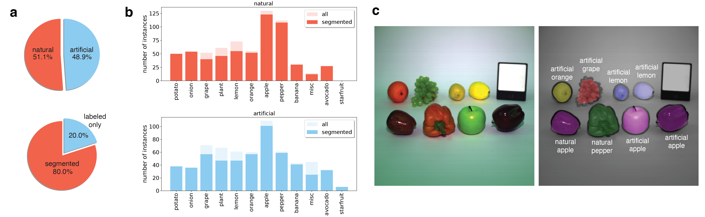
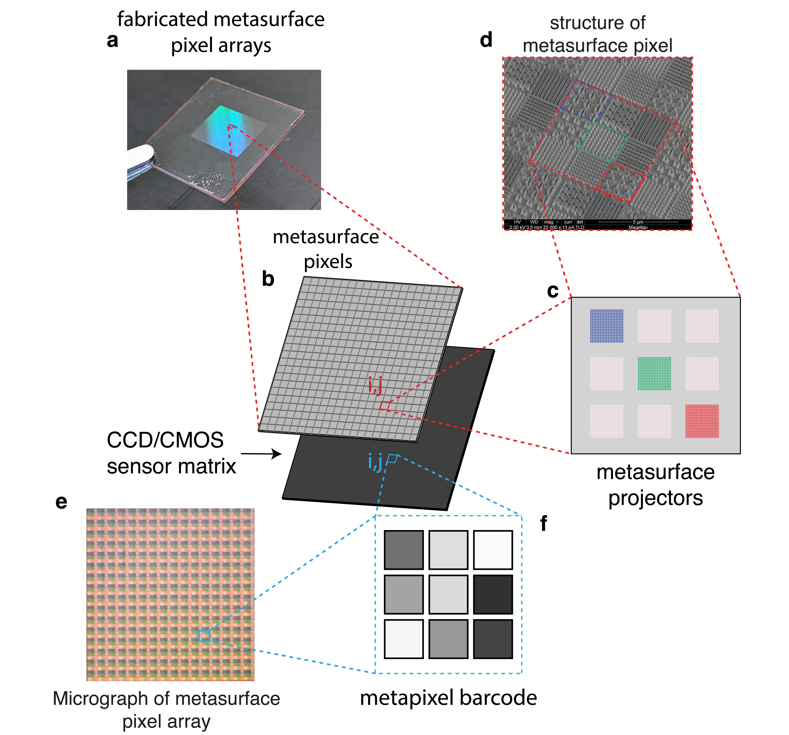

# Hyplex: Real-time Hyperspectral Imaging in Hardware via Trained Metasurface Encoders

## License
Use of this software implies accepting all the terms and conditions described in
the
[license](https://gitlab.kaust.edu.sa/makam0a/deepnano/-/blob/master/LICENSE)
document available in this repository.  We remind users that the use of this
software is permitted for non-commercial applications, and proper credit must be
given to the authors whenever this software is used.

## Overall description

This repository contains a dataset description and code examples of the Hyplex hyperspectral
imaging system described in details in the publication: 

*Real-time Hyperspectral Imaging in Hardware via Trained Metasurface
		Encoders*

available as an open access article at

The code makes use of the theory described in the publications:

*Broadband vectorial ultrathin optics with experimental efficiency up to 99% in the visible via universal approximators*
[Light: Science & Applications volume 10, Article number: 47 (2021)](https://www.nature.com/articles/s41377-021-00489-7). 

*Generalized Maxwell projections for multi-mode network Photonics* [Scientific Reports volume 10, Article number: 9038 (2020)](https://doi.org/10.1038/s41598-020-65293-6)

Users are encouraged to read both publications and familiarize themselves with the underlying theory and logic behind the  software.

#### FVgNET: spectral imaging dataset



One of the important contributions of our paper is publicly available large hyperspectral 
dataset for semantic segmentation of real and artificial fruits and vegetables: FVgNET. 
FVgNET is available for downloads in [dropbox](https://www.dropbox.com/sh/is3u2f0col0asvl/AAAu985tCpLDLkZM_NxFTYg7a?dl=0) or [google drive](https://www.dropbox.com/sh/is3u2f0col0asvl/AAAu985tCpLDLkZM_NxFTYg7a?dl=0) folders. 
FVgNET is comprised of 317 scenes showing fruits and vegetables, both natural and artificial, taken indoors under controlled
lighting conditions, and covering the 400-1000 nm range. We acquired
the images using a setup consisting of a white paper sheet arranged in an
infinity curve, a configuration employed in photography to isolate objects from
the background. We achieve good spectral coverage while minimizing the presence
of shadows in the final images by illuminating the objects with overhead white
LED indoor lighting, a 150 W halogen lamp (OSL2 from Thorlabs) equipped
with a glass diffuser and a 100 W tungsten bulb mounted in a diffuse
reflector.

We provide 80% of all images segmented and the remainder only labeled.
Panels a-b shows the distribution of object classes in the dataset.
For each class of objects (e.g., apple, orange, pepper), we generated an
approximately equal number of scenes showing: natural objects only and
artificial objects only. The dataset consists of 12 classes, represented in the
images proportionally to their chromatic variety.

The miscellaneous class corresponds to fruits and vegetables that do not have
a natural counterpart.
Approximately 40% of the scenes consist of a single row of objects located at
the camera's focal plane. The remaining scenes show two rows of objects, with
the focal plane located in between. We keep the position of the white
reference panel approximately constant throughout the dataset for easy
normalization. The hyperspectral images have a spatial resolution of
512x512 pixels and 204 spectral bands. We also provide an RGB image as
seen through the lens of the camera for each scene with the same spatial
resolution.

We incorporate semantic segmentation masks into the dataset by processing the
RGB images generated from the 204 spectral channels. We acquired the images in such a way as to avoid
the intersection of objects, allowing the automatic generation of masks marking
the areas occupied by each object. We then annotated each marked object,
identifying each object class and whether they are natural or artificial.
Panel c illustrates the implementation of the semantic segmentation
mask on an image of the dataset. 

FVgNETDemo.ipynb provides basic examples of how to use the provided dataset. 

#### Hyplex: real-time hypespectral imaging system




The Hyplex system, is a data-driven hyperspectral camera, which uses
state-of-the-art metasurfaces to replace macroscopic components with highly
integrated dielectric nanoresonators that manipulate light as feed-forward
neural networks. Metasurfaces have successfully demonstrated the ability to integrate various basic optical
components for different applications. Hyplex
leverages this technology to compress high-dimensional spectral data into a
low-dimensional space via suitably defined projectors (c-d),
designed with end-to-end learning of large hyperspectral datasets.
ALFRED, an open-source, inverse-design software exploiting artificial intelligence (AI), provides the
means to design the metasurface projectors. These nanostructures encode
broadband information carried by incoming spectra into a barcode composed of a
discrete pattern of intensity signals  (e-f). A physical
model-aware framework finds the optimal projectors' response with various
learning schemes, designed according to user end tasks.

# Getting started

## Requirements

### Hardware

The codes provided are optimized for running on a CUDA capable NVIDIA GPU.
While not strictly required, the user is advised that the neural network training
process can take several hours when running on the GPU and may become prohibitively
long if running on a single CPU. 

### Software

The use of a Linux based operating system is strongly recommended. 
All codes were tested on a Ubuntu 18.04 system.

A working distribution of python 3.8 or higher is required.
The use of the [anaconda python distribution](https://www.anaconda.com/) is recommended
to ease the installation of the required python packages.

Examples of use of this software are provided as Jupyter notebooks and as such 
it requires the [Jupyter notebook](https://jupyter.org/) package. Note that this package
is included by default in the anaconda distribution.


## Initial set up

The usage of an Ubuntu 18.04 system or similar with a CUDA capable GPU and the anaconda python
distribution is assumed for the rest of this document. 

### Obtaining the code

Begin by cloning this project. In a terminal, type:

```sh
$ git clone https://github.com/makamoa/hyplex
```

### Obtaining the dataset

From the terminal, you can download FVgNET dataset using the python utility [gdown](https://github.com/wkentaro/gdown)

```bash
$ pip install gdown
$ gdown https://drive.google.com/drive/folders/16KM88HjMBzAFZoh9LFO1_71hLlE4XX52?usp=sharing
```

To extract the zip file, the following command may be used

```bash
$ python -c "from zipfile import PyZipFile; PyZipFile( '''FVgNET.zip''' ).extractall()";
```


### System setup

The use of a separate python virtual environment is recommended for running the provided
programs. The file "environment.yml" is provided to quickly setup this environment in Linux
systems. To create an environment using the provided file and activate it do:

```bash
$ cd hyplex
$ conda env create -f environment.yml
$ conda activate hyplex
```
Note 'environment.yml' is intended to be used only with Linux systems.
Should the user experience problems with this file or be using another system 
a full list of requirements for running the code is available in the file
'requirements.txt' of the repository.

To use a Jupyter notebook inside the created virtual environment, type the following code:

```bash
pip install ipykernel ipython kernel install --user --name=hyplex
```
## Usage

Usage instructions are provided in the jupyter notebook files of the repository. The user is advised to first go through the 
file 'FVgNETDemo.ipynb' as it explains how to handle FVgNET data. The notebook can be viewed by executing the following commands:

```bash
$ jupyter notebook jupyter/FVgNETDemo.ipynb
```
Please ensure the kernel is the correct one once the notebook starts running.
 
## Citing

When making use of the provided codes in this repository or FVgNET dataset for your own work please ensure you reference the publication

The following biblatex entry may be used for this purpose.

